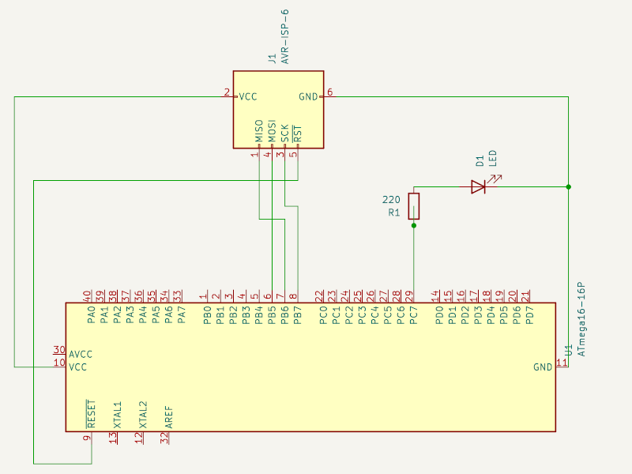
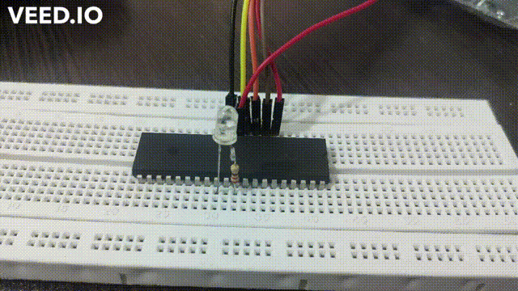
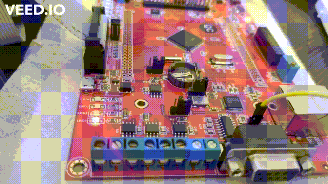

# Blink a LED
Simple Hello World! application on AVR ATmega16.

## Hardware Requirements:
1. ATmega16A
2. 220**𝛀** Resistor
3. LED
4. Breadboard
5. avrdude compatible AVR programmer (I used usbasp)

## Software Requirements:
1. VSCode + Extensions(C/C++, CMake, Commands)
2. CMake
3. avr-gcc
4. avrdude

## Schematic:


**Notes:**
- Using Port C7 for emiting LED is arbitrary

## Running steps:
Note that I used **Ubuntu** as my OS, so all commands here are Ubuntu commands.
1. **Installation**:
   1. install VSCode and extensions listed above. If you are a rookie in vscode see [Install Visual Studio Code extensions](https://code.visualstudio.com/learn/get-started/extensions)
   2. install avr-gcc, avrdude and some auxiliary apps:
    ```sh
    sudo apt-get install binutils gcc-avr avr-libc uisp avrdude
    ```

2. **Project Creation**:
   1. Create a directory for your project
   2. open VSCode and click **Open Folder..." on Get started page.
   3. Select created directory.
   4. Hit **Ctrl+N** to create a new file.
   5. type your **C** Code. (Use my code in **main.c** as a start)
3. **Config C/C++ Extension**:
   1. In the Command Palette (Open using **Ctrl+Shift+P**) type **Edit Configuration**. You should see an item titled **C/C++: Edit Configurations(UI)**. Click on it.
   2. You should provide some information:
      * Compiler path: You can find via ```which avr-gcc```. It is normally pointed to **/usr/bin/avr-gcc**
      * IntelliSense mode: Select **gcc-x86(legacy)**
      * Defines: for current project I used Atmega16. So I entered **__AVR_ATmega16A__**. Mind the underscores! You can find your chip on [https://www.nongnu.org/avr-libc/user-manual/using_tools.html](https://www.nongnu.org/avr-libc/user-manual/using_tools.html)
      * C standard: Select **c99**
      * C++ standard: Select **c++11**
4.  **Config Task Extension**:
    1.  Open Command Palette and type **Tasks: Configure Task** select proper result and then select **Create tasks.json file from template** and then select **Others**
    2.  Change the code to something like this:
```json
{
    // See https://go.microsoft.com/fwlink/?LinkId=733558
    // for the documentation about the tasks.json format
    "version": "2.0.0",
    "tasks": [
        {
            "label": "MakeAndFlash",
            "type": "shell",
            "command": "cd build && make flash",
            "problemMatcher": [],
            "group": {
                "kind": "build",
                "isDefault": true
            }
        }
    ]
}

```
5.  **Config Commands Extension**:
    1.  Open Command Palette and type **Commands: Edit Configuration**
    2.  Change opened file to something like this:
```json
{
  "commands": [
    {
      "command": "workbench.action.tasks.build",
      "text": "Build & Flash",
      "tooltip": "Build the project & flash To uc",
      "color": "#FFCC00"
    }
  ]
}
```
    3. Open Command Palette and Search **Commands: Refresh** and click on it. now you have see a button on status bar labled **Build & Flash** or whatever you selected. 
6.  **Create Workspace Settings file**:
    1.  From menu select **File -> Preferences -> Settings**
    2.  There is two tab on the page: User, and Workspace. Select **Workspace** and on the search bar enter **CMake** and select **CMake Tools** under **Extensions**
    3.  Scroll Down and find **CMake: Configure Settings** then click **Edit in settings.json**
    4.  Here you can set some global configuration variables for using in CMake.
    5.  Change it to something like:
```json
{
    "cmake.configureSettings": {
        "MCU": "atmega16a",
        "F_CPU": "8000000",
        "BAUD": "9600",
        "AVR_PART": "m16"
    }
}
```
7.  **Create CMake file**:
    1.  Create a file on root directory of your project name it: **CMakeLists.txt**
    2.  You can download it from my codes for starting point from [here](CMakeLists.txt)
8.  **RUN!**:
    1.  Connect your programmer to your system.
    2.  Hit **Ctrl+Shift+B** or click **Build & Flash** in the status bar.
    3.  Congratulations! you have made your fist embedded application!

**Preview**:



# Migration to STM32:
So my challenge was mixing AVR blink project with STM32 version as the code should be compiled on both without any code change!

## Hardware Requirements:
1. STM32 Development Board (I used a board based on STM32F107VC)
2. STM32 Debugger & Programmer (ST-LINK or J-Link)

## Software Requirements:
1. VSCode + Extensions(C/C++, CMake, Commands, Cortex-Debug)
2. STM32CubeMX
3. CMake
4. arm-gcc
5. Jlink/stlink programmer software

## Running steps:
1. **Setup Vscode**:
   You can use some tutorials on the web. I suggest [this one](https://prog.world/configuring-vscode-for-stm32-programming-in-linux-and-not-only-linux/).
2. **Create STM32CubeMX Project**:
   Project creation in STM32CubeMX is not so hard! Click proper pin and select **GPIO_Output** for enabling a pin as output pin.
   On the Clock Configuration tab you can calculate divider and multiplier values for your desired frequency or let CubeMX Calculate it for you. for the second option just type your desired frequency in **HCLK (MHz)** field and hit enter!
   Save your project and hit **GENERATE CODE** on top right corner of application. 
3. **Mixing Codes**:
   Now you have your first ready to code stm32 project!
   File structure of this project is not suitable for merging with my previous projects so I changed it! also note that compiling and linking file inclusion will be checked on cmake!
4. **Profile Selection**:
   I added a **PROFILE** setting to settings.js, so then created a list of hardware profiles there. Now based on hardware and project i want to build just will update this file and cheers!

**Preview**:


