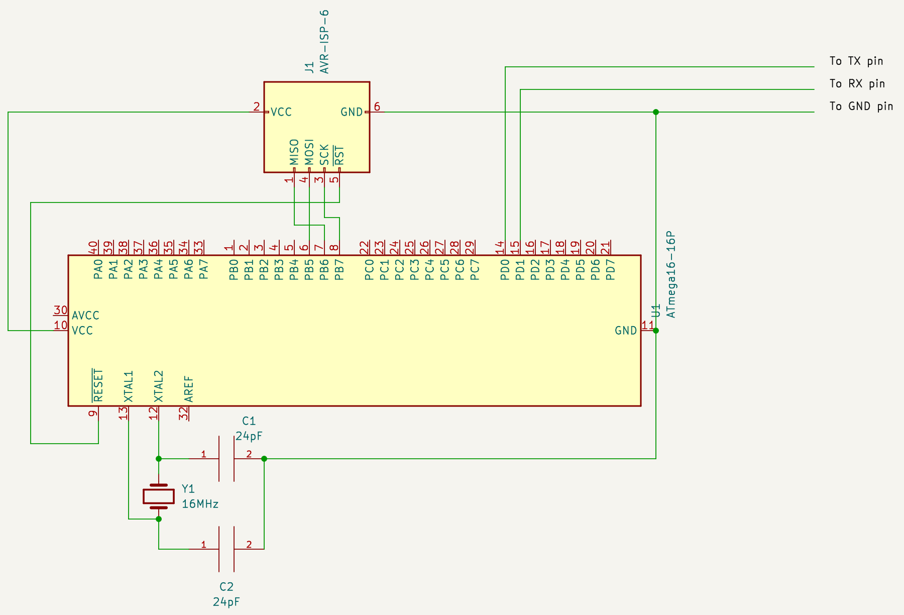
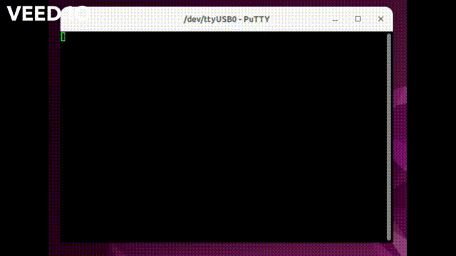

# Timer based Uart Communication
Understanding of How uart, timers and interrupts are working and installing external crystal was the aim of this project.

## Hardware Requirements:
1. ATmega16A
2. 16MHz Crystal
3. 22pF Capacitor * 2
4. USB to Serial Adapter. (I Used FT232 based board)
5. Breadboard
6. avrdude compatible AVR programmer (I used usbasp)

## Software Requirements:
1. VSCode + Extensions(C/C++, CMake, Commands)
2. CMake
3. avr-gcc
4. avrdude
5. Putty or any serial port communications program

## Schematic:


**Notes:**

For selecting proper uart speed use [This](https://trolsoft.ru/en/uart-calc) website. I tried **153600** baud but I couldn't communicate through putty. any advice on why and how is appreciated.

## Running steps:
Note that I used **Ubuntu** as my OS, so all commands here are Ubuntu commands.

1. **Project Creation**:
   1. Create a directory for your project
   2. open VSCode and click **Open Folder..." on Get started page.
   3. Select created directory.
   4. Hit **Ctrl+N** to create a new file.
   5. type your **C** Code. (Use my code in **main.c** as a start)
2. **Config MCU to use External Crystal**:
   1. I used [This website](http://eleccelerator.com/fusecalc/fusecalc.php?chip=atmega16a) to config MCU fuses. Do your config as you need. you can see the result bits under Manual Fuse Bit Manipulation section. any way my configs is: lfuse: 0xEF; hfuse: 0x99; lock: 0xFF.
   2. Open Terminal and type (Replace Lock bits with your config):
```sh
avrdude -c usbasp -p m16 -u -U hfuse:w:0x99:m
avrdude -c usbasp -p m16 -u -U lfuse:w:0xEF:m
avrdude -c usbasp -p m16 -u -U lock:w:0xFF:m 
```
3.  **Update Workspace Settings file**:
    Open **settings.json** and update file content as below:
```json
{
    "cmake.configureSettings": {
        "PROJECT": "timer",
        "MCU": "atmega16a",
        "F_CPU": "16000000",
        "BAUD": "115200",
        "AVR_PART": "m16"
    },
    "cmake.configureOnOpen": false,
    "files.associations": {
        "*.c": "c",
        "*.h": "c"
    }
}
```
1.  **Create CMake file**:
    Note that for portability of project configs, I separated CMake files in two part. The main CMake file which resides on **root directory**, is responsible for choosing project folder and set initial configs. the second CMake of is stored on each project directory and manages each project specific needs.
2.  **RUN!**:
    1.  Connect your programmer to your system.
    2.  Hit **Ctrl+Shift+B** or click **Build & Flash** in the status bar.
    3.  Congratulations! you have made your fist embedded application!

**Preview:**


